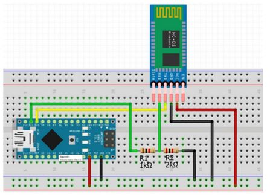

# Bragotron - Vizinform kijelző
Ardiuino // MAX7219 8x8 LED mártix alapú kijelző.

## Hardware

### Kijelző
Tetszölege számú kijelző összeköthető, a modulok darabszámát a `MAX_DEVICES` konstans tartalmazza.

### Bluetooth
HC-05 modul használata

Mivel a HC-05 modul írás tüskéjét 3.3V vezérli, egy 1k és 2k ellenállásból álló feszültségosztóra van szükség. Az RX  és TX láb bekötésének helyét az `RX_PIN` és a `TX_PIN` értékei mutatják. AT módba kapcsoláshoz az `EN` lábat HI-ra kell kötni.

## Arduino kezelőszoftver
### Használat
Csatlakoztasd a kijelzőt egy számítógéphez és küld rá soros porton keresztül a megjeleníteni kívánt szöveget latin2 kódolással. 

Használhatod PlatformIO monitor funkcióját, majd:
- CTRL+T CTRL+A és írd be, hogy latin2
- gépeld be a szöveget és üss entert.

### Bluetooth
Használhatsz tetszőleges bluetooth terminal programot, ami képes latin2 kódoással küldeni adatot vagy a szöveget előbb konvertáld HEX formátumba.

### Magyar betűtípus
- hun.h
- [szerkesztés vagy új készítése](https://pjrp.github.io/MDParolaFontEditor)
